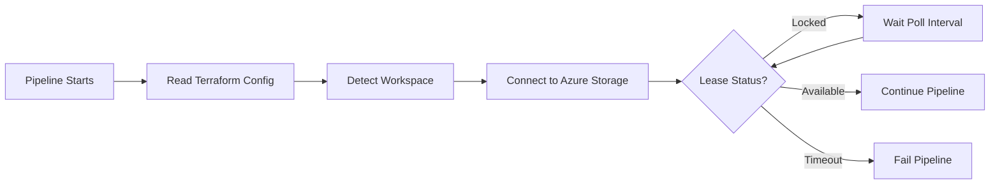

# Azure Backend Terraform State Lock Waiter

## Overview

The **Azure Backend Terraform State Lock Waiter** is an Azure DevOps task extension that enables pipelines executing Terraform deployments with Azure remote state backends to wait until a remote state has been released. This is particularly useful in scenarios where multiple pipelines or processes may be accessing the same Terraform state file, preventing conflicts and ensuring safe concurrent operations.

## What Does It Do?

When Terraform performs operations against an Azure Storage backend, it creates a lease (lock) on the state file to prevent concurrent modifications. If another process attempts to access the locked state file, it will fail. This extension solves that problem by:

1. **Detecting the Terraform backend configuration** from your project's `.terraform/terraform.tfstate` file
2. **Identifying the current workspace** (if using Terraform workspaces) from the `.terraform/environment` file
3. **Connecting to Azure Storage** using your Azure Service Connection credentials
4. **Polling the state file blob** to check its lease status at regular intervals
5. **Waiting patiently** until the lease is released or the state file becomes available
6. **Proceeding automatically** once the state is unlocked, allowing your pipeline to continue safely

## When Should You Use This Extension?

This extension is ideal for:

- **Parallel Pipeline Execution**: When multiple pipelines need to deploy to the same environment
- **Shared State Files**: When different teams or processes share Terraform state files
- **CI/CD Workflows**: Preventing pipeline failures due to locked state files
- **Long-Running Operations**: Automatically waiting for other Terraform operations to complete
- **Multi-Stage Deployments**: Coordinating sequential stages that depend on the same state

## How It Works



## Task Inputs

### Required Inputs

#### Azure Service Connection
- **Input Name**: `azureServiceConnection`
- **Type**: `connectedService:AzureRM`
- **Description**: The Azure Resource Manager Service Connection that has access to the Storage Account containing your Terraform state file. This connection is used to authenticate and check the blob lease status.

#### Terraform Project Path
- **Input Name**: `terraformProjectPath`
- **Type**: `string`
- **Description**: The absolute or relative path to the root directory of your Terraform project. This directory should contain the `.terraform` folder with the `terraform.tfstate` and optionally the `environment` file (for workspace detection).
- **Example**: `$(System.DefaultWorkingDirectory)/infrastructure`

### Optional Inputs

#### Maximum Wait Time (seconds)
- **Input Name**: `maxWaitTimeSeconds`
- **Type**: `string` (numeric)
- **Default**: `1800` (30 minutes)
- **Range**: 60 - 7200 seconds (1 minute to 2 hours)
- **Description**: The maximum amount of time (in seconds) the task will wait for the state file to become available. If the lease is not released within this time, the task will fail.

#### Poll Interval (seconds)
- **Input Name**: `pollIntervalSeconds`
- **Type**: `string` (numeric)
- **Default**: `10` seconds
- **Range**: 5 - 300 seconds (5 seconds to 5 minutes)
- **Description**: The interval (in seconds) between each check of the blob lease status. Lower values provide faster response but generate more API calls.

## Usage Example

### Basic Usage

```yaml
steps:
  - task: AzureBackendTerraformStateLockWaiter@1
    displayName: 'Wait for Terraform State to be Available'
    inputs:
      azureServiceConnection: 'MyAzureConnection'
      terraformProjectPath: '$(System.DefaultWorkingDirectory)/terraform'
```

### With Custom Timing

```yaml
steps:
  - task: AzureBackendTerraformStateLockWaiter@1
    displayName: 'Wait for Terraform State (5 min max, check every 15s)'
    inputs:
      azureServiceConnection: 'MyAzureConnection'
      terraformProjectPath: '$(Build.SourcesDirectory)/infrastructure'
      maxWaitTimeSeconds: '300'      # Wait up to 5 minutes
      pollIntervalSeconds: '15'      # Check every 15 seconds
```

### Complete Pipeline Example

```yaml
trigger:
  - main

pool:
  vmImage: 'ubuntu-latest'

steps:
  # Initialize Terraform
  - task: TerraformInstaller@0
    inputs:
      terraformVersion: 'latest'

  - task: TerraformTaskV4@4
    displayName: 'Terraform Init'
    inputs:
      provider: 'azurerm'
      command: 'init'
      workingDirectory: '$(System.DefaultWorkingDirectory)/terraform'
      backendServiceArm: 'MyAzureConnection'
      backendAzureRmResourceGroupName: 'my-rg'
      backendAzureRmStorageAccountName: 'mytfstate'
      backendAzureRmContainerName: 'tfstate'
      backendAzureRmKey: 'terraform.tfstate'

  # Wait for state to be available
  - task: AzureBackendTerraformStateLockWaiter@1
    displayName: 'Wait for Terraform State Lock Release'
    inputs:
      azureServiceConnection: 'MyAzureConnection'
      terraformProjectPath: '$(System.DefaultWorkingDirectory)/terraform'
      maxWaitTimeSeconds: '1800'
      pollIntervalSeconds: '10'

  # Apply Terraform changes
  - task: TerraformTaskV4@4
    displayName: 'Terraform Apply'
    inputs:
      provider: 'azurerm'
      command: 'apply'
      workingDirectory: '$(System.DefaultWorkingDirectory)/terraform'
      environmentServiceNameAzureRM: 'MyAzureConnection'
```

## Terraform Workspace Support

The extension automatically detects Terraform workspaces:

- **Default Workspace**: Uses the blob key directly as specified in your backend configuration
- **Named Workspaces**: Automatically constructs the workspace-specific blob path using the pattern `env:/{workspace}/{key}`

For example:
- Backend key: `terraform.tfstate`
- Workspace: `dev`
- Actual blob path: `terraform.tfstateenv:dev`

The workspace is detected from the `.terraform/environment` file in your Terraform project directory.

## Prerequisites

1. **Terraform Project**: Your Terraform project must use an `azurerm` backend configuration
2. **Azure Storage Account**: The backend storage account must be accessible via the Azure Service Connection
3. **Service Connection Permissions**: The service connection must have at least `Storage Blob Data Reader` permissions on the container
4. **Backend Configuration**: The `.terraform/terraform.tfstate` file must exist and contain valid backend configuration

### Required Backend Configuration

Your Terraform backend configuration should look like this:

```hcl
terraform {
  backend "azurerm" {
    resource_group_name  = "my-resource-group"
    storage_account_name = "mystorageaccount"
    container_name       = "tfstate"
    key                  = "terraform.tfstate"
  }
}
```

After running `terraform init`, this configuration is stored in `.terraform/terraform.tfstate`.

## Troubleshooting

### Task Fails: "Terraform state file not found"
- Ensure you've run `terraform init` before this task
- Verify the `terraformProjectPath` points to the correct directory containing `.terraform/`

### Task Fails: "Backend type is not azurerm"
- This extension only supports Azure Storage backends
- Check your Terraform backend configuration

### Task Times Out
- Another process may be holding the lease for longer than expected
- Increase `maxWaitTimeSeconds` if needed
- Check if there's a stuck Terraform process holding the lease

### Authentication Errors
- Verify your Azure Service Connection has access to the Storage Account
- Ensure the service principal has appropriate RBAC permissions (Storage Blob Data Reader or higher)

## Benefits

✅ **Prevent Pipeline Failures**: No more failed pipelines due to locked state files  
✅ **Safe Concurrent Operations**: Multiple pipelines can safely queue access to shared state  
✅ **Automatic Retry Logic**: Built-in polling eliminates manual intervention  
✅ **Workspace Aware**: Automatically handles Terraform workspace configurations  
✅ **Configurable Timeouts**: Customize wait times and polling intervals for your needs  
✅ **Clear Logging**: Detailed output shows lease status and remaining wait time  

## Support

For issues, questions, or contributions, please visit the [GitHub repository](https://github.com/Jnavarr56/Azure-Backend-Terraform-State-Lock-Waiter-AZDO-Extension).

## License

MIT
